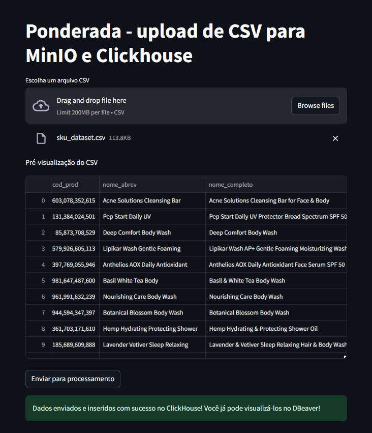
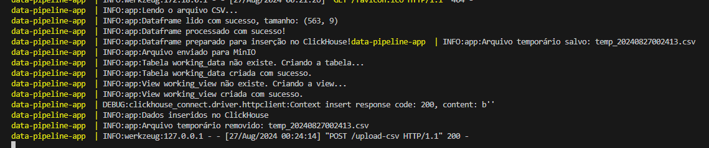
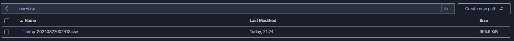
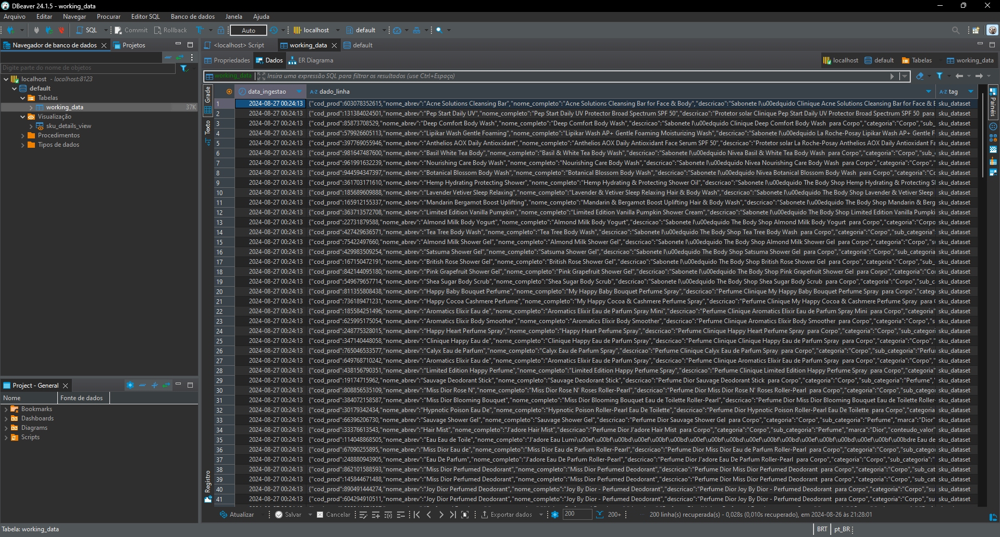
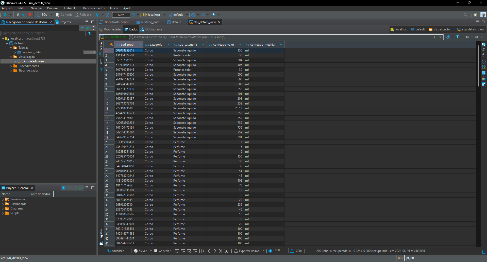

# Ponderada - upload de CSV para MinIO e Clickhouse
### Lívia Mattoso Bonotto Cabral

Esse projeto fornece um pipeline de dados que integra Flask, Streamlit, MinIO e ClickHouse. Ele permite que você faça upload de arquivos CSV, processe-os, armazene-os no MinIO e insira os dados no ClickHouse para serem analisados posteriormente. Como exemplo, usamos o dataframe sku_dataset e você pode baixá-lo [aqui](https://github.com/liviabonotto/ponds-s3-m11/blob/main/sku_dataset.csv). 

## Pré-requisitos

- Docker e Docker Compose instalados
- Python 3.12
- DBeaver

## 1. Clone o repositório

```bash
git clone https://github.com/liviabonotto/ponds-s3-m11
cd ponds-s3-m11
```

## 2. Construa e inicie os serviços:
```docker-compose up --build```

#### Isso irá iniciar:
- Instalação de dependências;
- Aplicação Flask em http://localhost:5000
- Aplicação Streamlit em http://localhost:8501
- Console do MinIO em http://localhost:9001
- ClickHouse em http://localhost:8123

## 3. Fazendo upload de um arquivo CSV
- Baixe o dataframe [aqui](https://github.com/liviabonotto/ponds-s3-m11/blob/main/sku_dataset.csv);
- Acesse a aplicação Streamlit em http://localhost:8501;
- Faça o upload do seu arquivo CSV.



## 4. Logs da aplicação
Você pode visualizar os logs da aplicação no mesmo terminal onde iniciou o Docker. 



## 5. Arquivo enviado para o MinIO
Você agora pode visualizar o arquivo temporário na interface do MinIO.




## 6. Visualizando no DBeaver
- Conecte com o Clickhouse na porta 8123;
- Visualize a tabela working_data e a view sku_details_view;
- Caso haja alguma nova inserção, não esqueça de dar refresh. 





